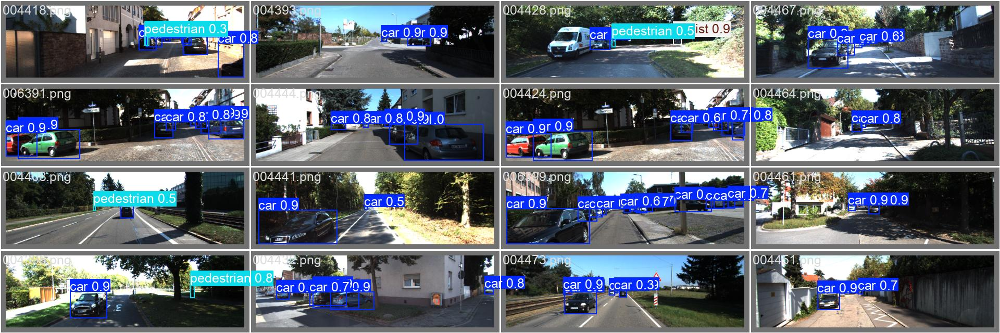
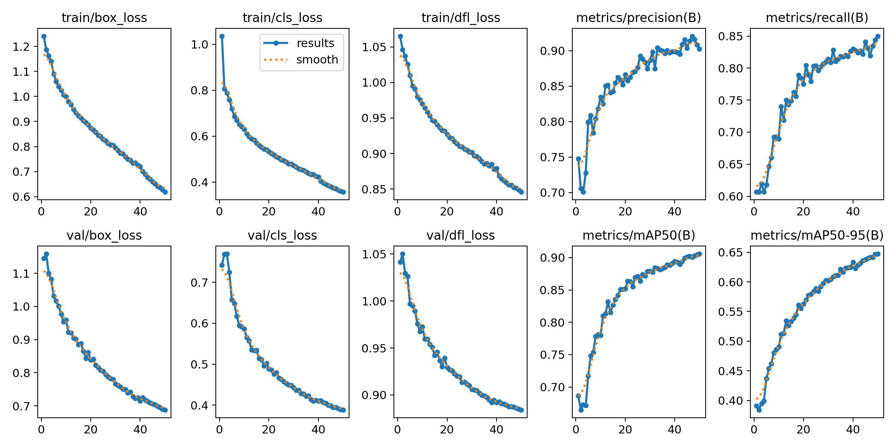

# Real-Time Road Object Detection and Tracking

YOLOv8 road-scene perception pipeline for detecting and tracking cars, pedestrians, and cyclists in real traffic footage.

The project starts from KITTI object-detection labels, converts them to YOLO format, trains YOLOv8 models on RWTH CLAIX HPC, benchmarks the results, and runs local video tracking with ByteTrack.



## Why This Project Exists

Road perception is one of the core tasks behind driver-assistance and autonomous-vehicle systems. This repo is a compact version of that workflow:

- prepare a clean detection dataset
- train lightweight and stronger YOLOv8 models
- compare accuracy and training cost
- run inference locally on images, webcam, and road videos
- use ByteTrack to keep object identities stable across frames

The focus is practical execution, not a toy notebook.

## What It Detects

| Class ID | Class |
|---:|---|
| 0 | car |
| 1 | pedestrian |
| 2 | cyclist |

## Results

Three final HPC experiments were compared on the same validation split.

| Model | Batch | LR Schedule | Precision | Recall | mAP50 | mAP50-95 | HPC Train Time |
|---|---:|---|---:|---:|---:|---:|---:|
| YOLOv8n | 16 | default | 0.88290 | 0.77891 | 0.86590 | 0.59404 | 34.85 min |
| YOLOv8s | 16 | default | 0.90265 | 0.85003 | 0.90572 | 0.64728 | 51.50 min |
| YOLOv8s | 32 | cosine | 0.91500 | 0.83952 | 0.89980 | 0.64136 | 35.94 min |

Best accuracy: `YOLOv8s batch 16 default`.

Best speed/accuracy tradeoff: `YOLOv8s batch 32 cosine`, which gets close to the best model while training much faster.



## Repository Structure

```text
.
+-- data/
|   +-- road_dataset/data.yaml
+-- scripts/
|   +-- convert_kitti_to_yolo.py
|   +-- visualize_yolo_labels.py
|   +-- benchmark_fps.py
|   +-- train_hpc.sbatch
+-- outputs/
|   +-- yolov8n_b16_default/
|   +-- yolov8s_b16_default/
|   +-- yolov8s_b32_cos/
+-- Documents/
|   +-- hpc_training_experiment_plan.md
|   +-- model_metrics_comparison.md
|   +-- model_metrics_summary.csv
|   +-- commands_used_training_tracking.md
+-- requirements.txt
```

Large datasets, raw videos, training runs, and trained weights are intentionally kept out of Git. Curated plots and example predictions are included under `outputs/`.

## Dataset

The project uses the KITTI Object Detection dataset converted to YOLO format.

Expected local layout:

```text
data/road_dataset/
+-- images/
|   +-- train/
|   +-- val/
+-- labels/
|   +-- train/
|   +-- val/
+-- data.yaml
```

The final split used:

| Split | Images | Labels |
|---|---:|---:|
| train | 5984 | 5984 |
| val | 1497 | 1497 |

## Setup

```powershell
python -m venv .venv
.\.venv\Scripts\Activate.ps1
pip install -r requirements.txt
```

Install a PyTorch build that matches your machine separately if needed.

On RWTH CLAIX, the project used:

- Python 3.9
- Ultralytics 8.4.51
- PyTorch 2.8.0 with CUDA
- NVIDIA H100 GPU through Slurm

## Local Inference

Place a trained checkpoint in `models/`, for example:

```text
models/HPC_R1_best.pt
```

Run prediction on validation images:

```powershell
.\.venv\Scripts\yolo.exe task=detect mode=predict model=models/HPC_R1_best.pt source=data/road_dataset/images/val save=True conf=0.25
```

Run webcam inference:

```powershell
.\.venv\Scripts\yolo.exe task=detect mode=predict model=models/HPC_R1_best.pt source=0 show=True
```

## Video Tracking With ByteTrack

Ultralytics can run YOLO detection and ByteTrack tracking in one command:

```powershell
.\.venv\Scripts\yolo.exe track model=models/HPC_R1_best.pt source=data/Videos/demo_video.mp4 tracker=bytetrack.yaml save=True conf=0.25
```

Outputs are written under `runs/detect/track*`.

## HPC Training

Default training is defined in:

```text
scripts/train_hpc.sbatch
```

Submit the baseline job from the HPC repo folder:

```bash
sbatch scripts/train_hpc.sbatch
```

For custom experiment settings, use `--wrap` so Slurm receives the variables reliably:

```bash
sbatch --job-name=yolov8s_b16 \
  --output=/hpcwork/niy86040/road-scene-yolov8/runs/slurm/%x-%j.out \
  --error=/hpcwork/niy86040/road-scene-yolov8/runs/slurm/%x-%j.err \
  --time=12:00:00 --partition=c23g --nodes=1 --ntasks=1 \
  --cpus-per-task=4 --mem=32G --gres=gpu:1 \
  --chdir=/hpcwork/niy86040/road-scene-yolov8 \
  --wrap="MODEL=yolov8s.pt RUN_NAME=yolov8s_b16_default EPOCHS=50 BATCH=16 COS_LR=False LR0=0.01 LRF=0.01 bash scripts/train_hpc.sbatch"
```

See [commands_used_training_tracking.md](Documents/commands_used_training_tracking.md) for the full command log.

## Reading The Outputs

The most useful files are:

- `outputs/*/Metrics/*results.csv` - per-epoch training metrics
- `outputs/*/Metrics/*results.png` - training curves
- `outputs/*/Metrics/*confusion_matrix*.png` - class-level mistakes
- `outputs/*/Images/*pred.jpg` - validation predictions
- `Documents/model_metrics_comparison.md` - final experiment comparison

For a deeper guide, see [how_to_read_outputs.md](Documents/how_to_read_outputs.md).

## Main Takeaway

YOLOv8s improves the detector noticeably over YOLOv8n, especially for pedestrians and cyclists. Batch 16 gives the best final accuracy, while batch 32 with cosine scheduling is the better practical tradeoff when training time matters.
